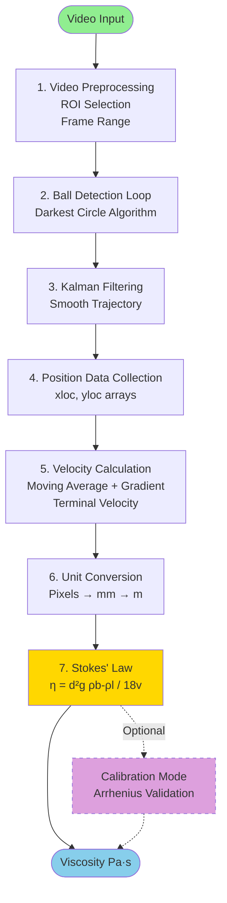

# Viscum Algorithm Flowchart

This flowchart shows the complete viscosity measurement algorithm.

## How to Convert to Image for Presentation

### Option 1: Online (Easiest)
1. Go to https://mermaid.live
2. Copy the Mermaid code below
3. Paste into the editor
4. Click "Download PNG" or "Download SVG"

### Option 2: VS Code
1. Install "Markdown Preview Mermaid Support" extension
2. Open this file and preview it
3. Take a screenshot

### Option 3: Command Line (requires mermaid-cli)
```bash
npm install -g @mermaid-js/mermaid-cli
mmdc -i FLOWCHART.md -o flowchart.png -w 2400 -H 3000
```

---

## Mermaid Flowchart Code

```mermaid
flowchart TD
    Start([Start: Video File]) --> LoadVideo[Load Video with OpenCV]
    LoadVideo --> GetMetadata[Extract Metadata<br/>FPS, Frame Count, Resolution]
    GetMetadata --> InputROI[User Input: ROI Coordinates<br/>x1, y1, x2, y2]
    InputROI --> ValidateROI{Valid ROI?<br/>x2>x1, y2>y1<br/>Within bounds?}
    ValidateROI -->|No| ErrorROI[Error: Invalid ROI]
    ValidateROI -->|Yes| InputFrames[User Input: Frame Range<br/>Start Frame, End Frame]

    InputFrames --> ValidateFrames{Valid Range?<br/>Start < End<br/>Within video?}
    ValidateFrames -->|No| ErrorFrames[Error: Invalid Frame Range]
    ValidateFrames -->|Yes| InitTracking[Initialize Tracking Variables<br/>xloc, yloc, frame_num<br/>diameters, confidences]

    InitTracking --> InitKalman[Initialize Kalman Filter = None<br/>dt = 1/fps]
    InitKalman --> LoopStart{For each frame<br/>k in start:end}

    LoopStart -->|Next Frame| ReadFrame[Read Frame k<br/>Convert to Grayscale]
    ReadFrame --> CropROI[Crop to ROI]
    CropROI --> KalmanExists{Kalman<br/>Initialized?}

    KalmanExists -->|Yes| KalmanPredict[Kalman Predict<br/>predicted_center = x̂k]
    KalmanExists -->|No| NoPrediction[predicted_center = None]

    KalmanPredict --> DetectBall[Detect Ball:<br/>find_darkest_circle<br/>with predicted_center hint]
    NoPrediction --> DetectBall

    DetectBall --> BallFound{Ball<br/>Detected?<br/>cx, cy ≠ None}

    BallFound -->|Yes| FirstDetection{First<br/>Detection?}
    BallFound -->|No| HasKalman{Has<br/>Kalman?}

    HasKalman -->|Yes| UsePrediction[Use Kalman Prediction<br/>center = predicted_center<br/>confidence = 0.3]
    HasKalman -->|No| SkipFrame[Skip Frame<br/>Continue to Next]

    FirstDetection -->|Yes| CreateKalman[Initialize Kalman Tracker<br/>KalmanTracker cx, cy, dt]
    FirstDetection -->|No| UpdateKalman[Update Kalman Filter<br/>xk = update cx, cy]

    CreateKalman --> UpdateKalman
    UsePrediction --> UpdateKalman

    UpdateKalman --> StoreData[Store Data:<br/>xloc append x<br/>yloc append y<br/>diameters append d<br/>confidences append conf]

    StoreData --> Visualize[Visualize:<br/>Draw circle on frame<br/>Show confidence color<br/>Save debug images]

    Visualize --> LoopStart
    SkipFrame --> LoopStart

    LoopStart -->|Done| ConvertArrays[Convert to NumPy Arrays<br/>xloc, yloc, frame_num]

    ConvertArrays --> CalcTime[Calculate Time Vector<br/>time = frame_num - start / fps]
    CalcTime --> MovingAvg[Apply Moving Average Filter<br/>window_size = min 20, num_frames/3<br/>yloc_filtered = filter yloc]

    MovingAvg --> SkipAccel[Skip Acceleration Frames<br/>skip_frames = min 24, num_frames-5]
    SkipAccel --> CalcVelocity[Calculate Velocity<br/>velocity = gradient yloc_filtered, time<br/>from skip_frames onward]

    CalcVelocity --> EnoughData{Enough<br/>Data Points?<br/>≥ 4 points}

    EnoughData -->|Yes| PolyFit[Polynomial Fit<br/>v t = at³ + bt² + ct + d]
    EnoughData -->|No| UseFiltered[Use Filtered Velocity]

    PolyFit --> TerminalVel[Terminal Velocity<br/>v_terminal = velocity_filtered-1]
    UseFiltered --> TerminalVel

    TerminalVel --> CalcAvgDiam[Calculate Average Diameter<br/>avg_diameter = mean ball_diameters]
    CalcAvgDiam --> InputPhysical[User Input Physical Parameters:<br/>real_diameter_mm<br/>g m/s²<br/>ball_density kg/m³<br/>liquid_density kg/m³]

    InputPhysical --> ValidatePhysical{Valid<br/>Parameters?<br/>d>0, g>0<br/>ρb > ρl}
    ValidatePhysical -->|No| ErrorPhysical[Error: Invalid Parameters]
    ValidatePhysical -->|Yes| CalcConversion[Calculate Conversion<br/>mm_per_pixel = real_diameter / pixel_diameter]

    CalcConversion --> ConvertVelocity[Convert Velocity<br/>velocity_mm_s = v_terminal × mm_per_pixel<br/>velocity_m_s = velocity_mm_s / 1000]

    ConvertVelocity --> StokesLaw[Apply Stokes' Law<br/>η = d²g ρb - ρl / 18v<br/>d in meters<br/>v in m/s]

    StokesLaw --> DisplayResults[Display Results:<br/>- Average Diameter<br/>- Velocity mm/s<br/>- Viscosity Pa·s<br/>- Confidence Avg]

    DisplayResults --> Calibration{Calibration<br/>Test?}

    Calibration -->|No| End([End])
    Calibration -->|Yes| InputCalib[Input Calibration Data:<br/>Temperature °C<br/>η at 40°C cP<br/>η at 100°C cP]

    InputCalib --> Arrhenius[Calculate Arrhenius Parameters:<br/>Ea = R ln η1/η2 / 1/T1 - 1/T2<br/>A = η1 / exp Ea/RT1]

    Arrhenius --> CalcExpected[Calculate Expected Viscosity<br/>η_expected = A × exp Ea/RT_test]
    CalcExpected --> CalcError[Calculate Relative Error<br/>error = abs η_exp - η_meas / η_exp]

    CalcError --> DisplayCalib[Display Calibration Results:<br/>- Activation Energy<br/>- Pre-exponential Factor<br/>- Expected Viscosity<br/>- Relative Error %]

    DisplayCalib --> End
    ErrorROI --> End
    ErrorFrames --> End
    ErrorPhysical --> End

    style Start fill:#90EE90
    style End fill:#FFB6C1
    style ErrorROI fill:#FF6B6B
    style ErrorFrames fill:#FF6B6B
    style ErrorPhysical fill:#FF6B6B
    style StokesLaw fill:#87CEEB
    style DetectBall fill:#FFE4B5
    style KalmanPredict fill:#DDA0DD
    style Arrhenius fill:#F0E68C
```



---

## Simplified Version (for slides with less detail)



---

## Legend

### Shapes
- **Rounded Rectangle** (Start/End): Beginning and termination points
- **Rectangle**: Process or computation step
- **Diamond**: Decision/conditional branch
- **Parallelogram**: Input/Output operation

### Colors
- **Green**: Start
- **Pink/Red**: End/Errors
- **Light Blue**: Main calculation (Stokes' Law)
- **Yellow/Beige**: Ball detection
- **Purple**: Kalman filter operations
- **Light Yellow**: Arrhenius/calibration

### Flow
- **Solid lines**: Main algorithm flow
- **Dashed lines**: Optional calibration path
